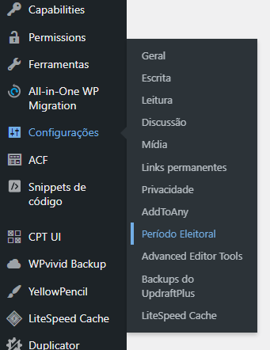
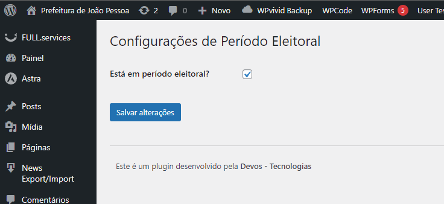

# Período Eleitoral

Este plugin WordPress foi desenvolvido para o site da Prefeitura de João Pessoa com o objetivo de ocultar classes e IDs específicos conforme a necessidade, especialmente durante o período eleitoral, em conformidade com as leis.

## Funcionalidades

- Oculta elementos do site com base em classes e IDs específicos.
- Interface de simples visualização para habilitar ou desabilitar funcionalidades através de um checkbox.
- Projetado para garantir a conformidade com as leis eleitorais, ocultando propagandas, notícias e projetos da prefeitura durante o período eleitoral.

## Requisitos

- WordPress 5.0 ou superior

## Instalação

1. Baixe o plugin.
3. No painel administrativo do WordPress, vá para `Plugins` adicione e ative o `Período Eleitoral`.

## Uso

### Configuração do Plugin

1. No painel administrativo do WordPress, vá para `Configurações` > `Período Eleitoral`.
 
2. Use os checkboxes para habilitar ou desabilitar a ocultação dos elementos desejados.
 
4. Salve as configurações.

### Exemplo de Configuração

Suponha que você queira ocultar elementos com a classe `.propaganda` e o ID `#noticias` durante o período eleitoral. Basta editar o arquivo base, marcar os checkboxes correspondentes e salvar as alterações.